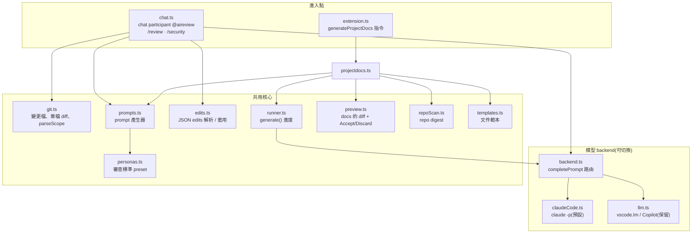
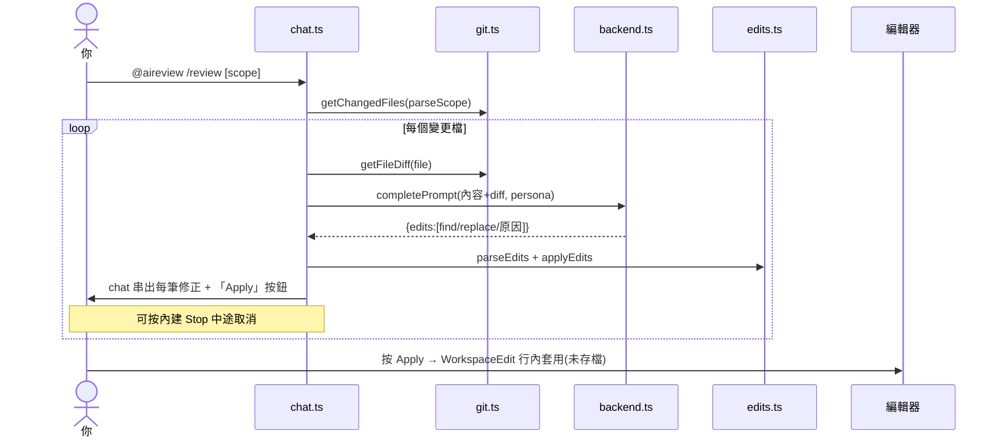
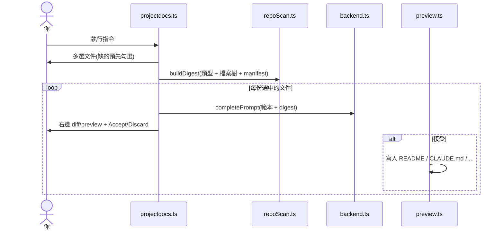
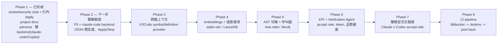

# 專案規劃 — AI Code Review & Docs 擴充套件

> 快照:2026-05-28。這是某個時間點的規劃與架構備份,請隨專案進度更新。

一個以 LLM agent 做 code review、security check、文件生成的 VSCode 擴充套件。模型 backend **可切換**:預設 `claude-code`(spawn `claude -p` CLI,用現有 Claude Code 登入、免 API key)、或 `vscode-lm`(Copilot,保留)。零 runtime npm 依賴。

進入點:

- **Chat participant `@aireview`** — `/review`、`/security`(主要入口)
- `aiReview.reviewCode` / `aiReview.securityCheck` 指令 — 會自動開 chat 並帶入 `@aireview /review`
- `aiReview.generateProjectDocs` 指令 — Generate Project Docs(README、Architecture…)

## 1. 目前架構

`prompts.ts`、`edits.ts`、`repoScan.ts`、`personas.ts`、`git.ts` 的純函式部分由單元測試覆蓋(不 import `vscode`)。所有模型呼叫一律走 `backend.ts` 的 `completePrompt`,不直接碰 `vscode.lm` 或 CLI。



## 2. 每條流程怎麼跑

### Review / security(chat participant,行內 Apply,無 modal)



persona 來自 `aiReview.reviewPersona` 設定(preset 或自訂文字),review/security 共用;與 diff 範圍(審什麼)正交。

### Project-docs 流程



## 3. Roadmap



| 階段 | 範圍 | 對應白板 | 工作量 | 依賴 |
|---|---|---|---|---|
| 1(已完成) | chat review/security 行內 Apply + project docs + persona + 雙 backend | doc gen、skills | 完成 | — |
| 2 | 實機驗證、穩健度 | — | S | Claude Code CLI(已裝) |
| 3 | 用 VSCode LSP 拉跨檔上下文 | — | S–M | 無新增 |
| 4 | embeddings + 語意搜尋 | Search、RAG | M | vector store |
| 5 | tree-sitter 切塊 + Neo4j 圖 | AR to FC to BB to CC、graph | L | tree-sitter, Neo4j |
| 6 | KPI 儀表板 + Verification Agent | 品質維度、accept rate | M–L | webview |
| 7 | 雙模型驗證 | accept-rate 數學、model-council | M | 第二個模型 / router |
| 8 | CI 串接 | Bitbucket/Jenkins post-back | L | server、webhook |

## 4. 待決定(open decisions)

### 功能要不要變成「skills」(對應白板的 Skills 節點)
「變 skills」有兩種意思:

- **A. 擴充內部的宣告式 skill registry** — 每個功能 = 一筆描述 `{ name, description, systemPrompt, outputType: "edits"|"doc", trigger }`;`prompts.ts` + persona 收斂成「資料 + 一個引擎」。**保留嚴格 JSON edits 契約、與 backend 無關**,加新功能只要加一筆。
- **B. 真正的 Claude Code SKILL.md** — 寫成 `.claude/skills/` 的 skill,擴充只負責叫 `claude` 去用。可讓 `claude` 自己探索 repo(doc-gen 甚至能省掉 `repoScan`)。代價:**破壞 inline Apply 需要的嚴格 JSON 契約**(agentic 輸出難穩定解析),且**只在 claude-code backend 有效**。

**傾向(未拍板):** review/security 留 **A**(要精準行內修正);doc-gen 可試 **B**(自由 markdown + 自行探索 repo)。核心取捨:結構化/可預測(A)vs agentic/有彈性(B)。**之後再決定。**

## 備註

- **下一步 = Phase 2 實機驗證。** 重點:現在用 **claude-code backend 就能跑、不需要 Copilot 配額**。F5 開 Extension Development Host → 在 Chat 打 `@aireview /review` → 確認 chat 串流 + 每筆 Apply 按鈕行內套用 + Stop 中途取消;再跑 `generateProjectDocs` 確認 diff/accept。把結果回報,有 bug 再修。
- **要驗的不確定點:** chat participant API、`stream.button`、`workbench.action.chat.open` 帶 query、`claude` CLI 的 PATH(VSCode GUI 繼承的 PATH 可能不含 `~/.local/bin`,必要時把 `aiReview.claudeCodePath` 設絕對路徑)。
- **第一個真正的分岔:** Phase 2 之後,選 Phase 3(VSCode LSP 補跨檔上下文,便宜)還是直接跳 Phase 4(embeddings/搜尋),取決於是否近期就要 repo 範圍搜尋。
- **刻意延後的部分:** 索引引擎(embeddings/AST/Neo4j)、KPI/verification、cross-model、CI 都還沒做。
```
